<div align="center">

# IoT Positioning & Mobility Prediction Ecosystem

[](https://openjdk.org/)
[](https://developer.mozilla.org/en-US/docs/Web/JavaScript)
[](https://html.spec.whatwg.org/)
[](https://plotly.com/javascript/)
[](https://visjs.org/)

**M1 IoT · Positioning Systems, Techniques & Applications (PSTA)**
**Université Marie et Louis Pasteur, Montbéliard · March 2026**

[👤 GitHub Profile](https://github.com/AhmedAlmuharaq)

</div>

---

## Overview

<div align="center">
  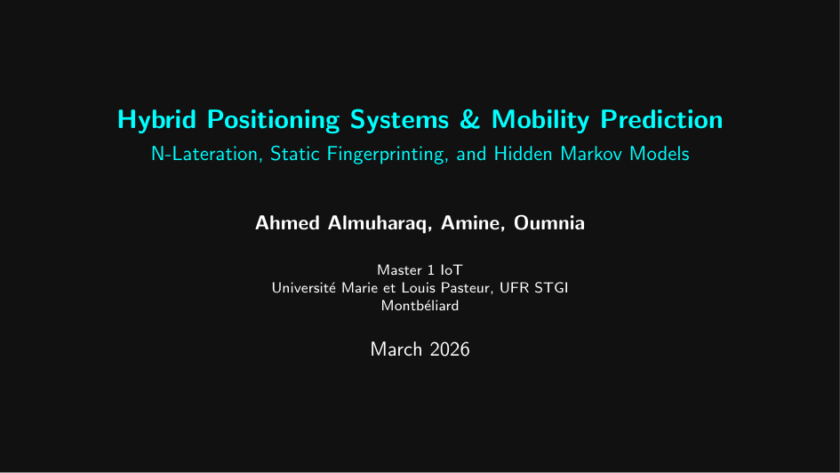
</div>

A comprehensive hybrid positioning and mobility prediction ecosystem implemented in both **Java** (algorithmic core) and **JavaScript** (interactive web dashboard). The project transitions from reactive geometric localization to proactive, probabilistic mobility prediction — three algorithms, one unified SPA.

<div align="center">
  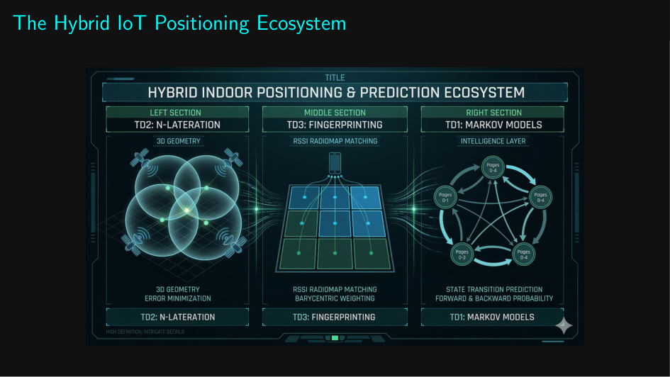
</div>

---

## Module 1 — 3D N-Lateration (Geometric Localization)

<div align="center">
  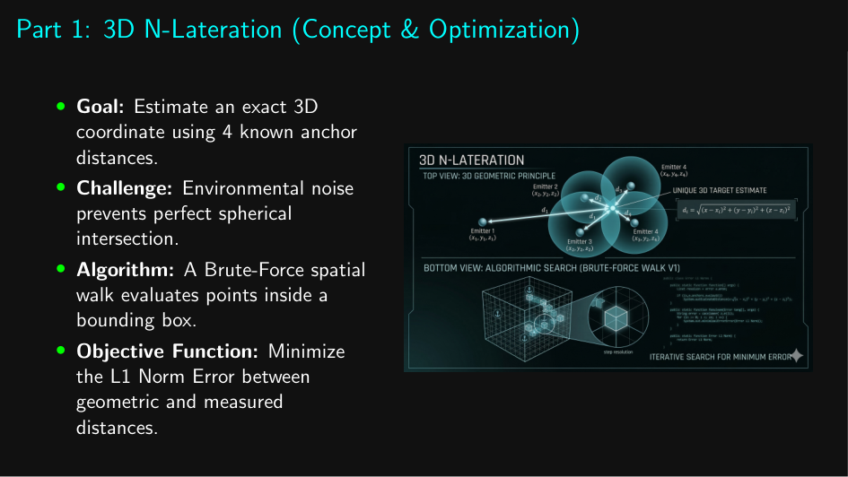
</div>

Designed for **outdoor, line-of-sight** environments. Estimates the exact 3D coordinates `(X, Y, Z)` of a mobile terminal using distances to N anchor emitters.

### Algorithm

```
Objective Function: minimize  Σ |dist(P, Eᵢ) − dᵢ|   (L1 Norm Error)

For each candidate P = (x, y, z) inside the bounding box:
    error += |√((x−Eᵢ.x)² + (y−Eᵢ.y)² + (z−Eᵢ.z)²) − dᵢ|
Best P = argmin(error)
```

- **Search space:** Dynamic bounding box computed from each anchor's reach `[Eᵢ.pos ± dᵢ]`
- **Walk step:** Configurable — 1.0 m (fast), 0.5 m (balanced), 0.1 m (high precision)
- **Supports:** N = 3 or N = 4 anchor configurations

### UML Architecture

<div align="center">
  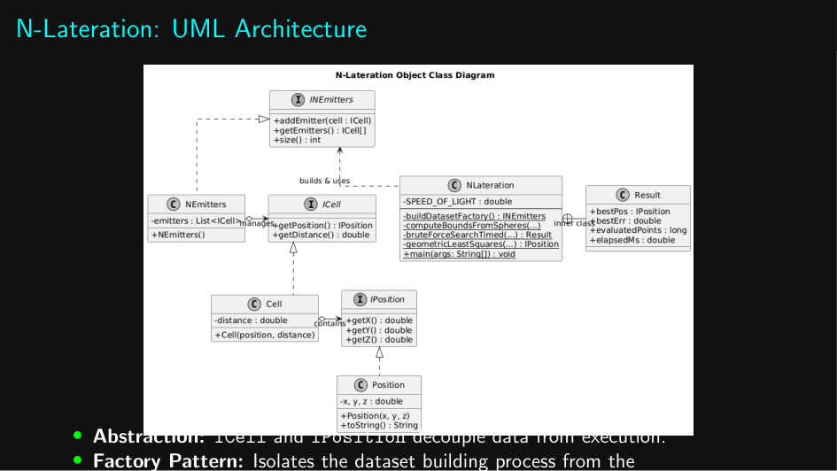
</div>

- **Abstract Factory Pattern** isolates the object-building process
- Interfaces: `ICell`, `IPosition`, `INEmitters` — fully decoupled from implementation
- Java classes: `Cell`, `Position`, `NEmitters`, `NLateration`, `NLaterationBonus`

### 3D Visualization

<div align="center">
  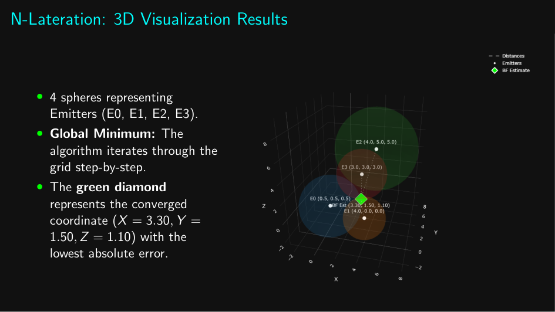
</div>

Four wireframe spheres (one per emitter) rendered via Plotly.js — the **green diamond** is the estimated position P̂ at the global L1 minimum. Result: `X = 3.50, Y = 1.50, Z = 1.50`.

---

## Module 2 — Static Fingerprinting (Indoor Localization)

<div align="center">
  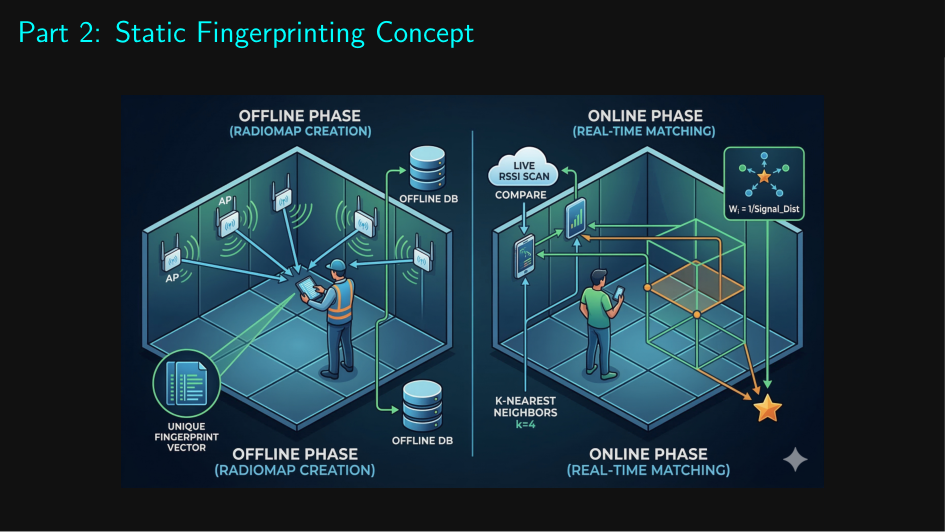
</div>

Designed to bypass **indoor signal multipath fading** by relying on an offline radiomap rather than geometric distance equations.

### Two-Phase Protocol

| Phase | What happens |
|-------|-------------|
| **Offline** | Surveyor walks the grid, recording RSSI vectors at each cell `Cᵢ(x, y)` → builds radiomap database |
| **Online** | Mobile device submits live RSSI → K-NN matches to radiomap → IDW barycenter gives final position |

### K-NN + IDW Algorithm

<div align="center">
  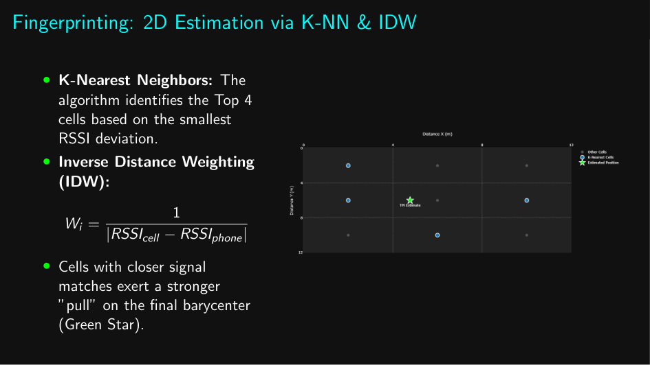
</div>

```
1. Manhattan distance per cell:
      dist(Cᵢ) = Σⱼ |RSSIᵢ[j] − RSSIphone[j]|

2. Select Top-K cells (smallest dist)

3. Inverse Distance Weighting barycenter:
      Wᵢ = 1 / dist(Cᵢ)
      P̂ = (Σ Wᵢ · Cᵢ.x / Σ Wᵢ ,  Σ Wᵢ · Cᵢ.y / Σ Wᵢ)
```

Cells with closer RSSI signatures exert a stronger pull on the final barycenter (green star).

### UML Architecture

<div align="center">
  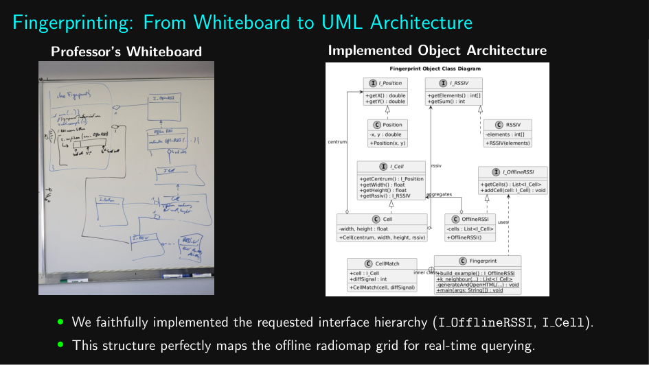
</div>

Faithfully implements the requested interface hierarchy: `I_Cell`, `I_OfflineRSSI`, `I_Position`, `I_RSSIV` — maps the professor's whiteboard design exactly.

---

## Module 3 — Mobility Prediction with Hidden Markov Models

<div align="center">
  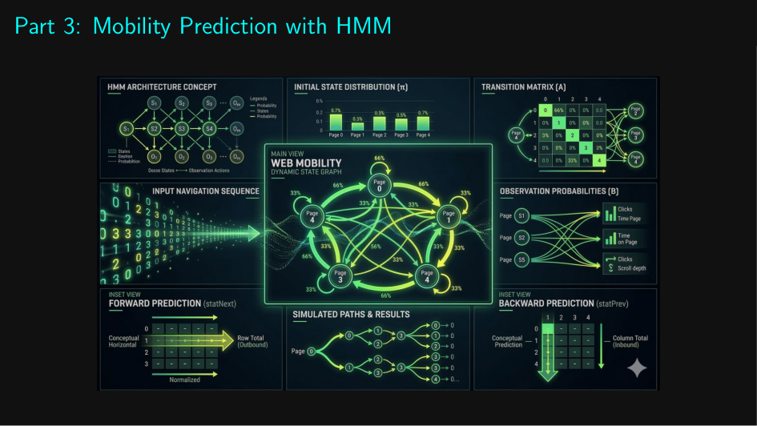
</div>

Adds **predictive intelligence** — instead of just knowing *where* a user is, the system forecasts *where they will go next*.

### Dual-Probability Architecture

<div align="center">
  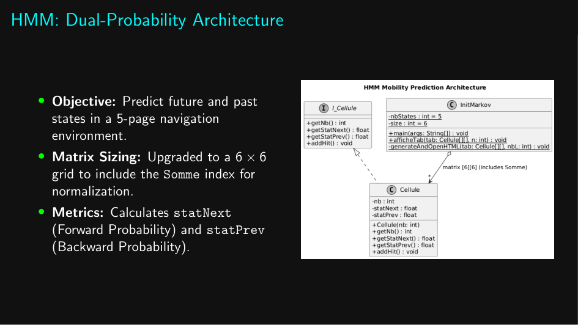
</div>

A dynamic **6×6 transition matrix** tracks navigation events across 5 web pages (states 0–4), with a 6th row/column for totals.

| Metric | Formula | Meaning |
|--------|---------|---------|
| **Next (Forward)** | `statNext = Nb(i→j) / Nb(i→*)` | Probability of going to j from i |
| **Prev (Backward)** | `statPrev = Nb(i→j) / Nb(*→j)` | Probability of having come from i when at j |

### Interactive State Graph

<div align="center">
  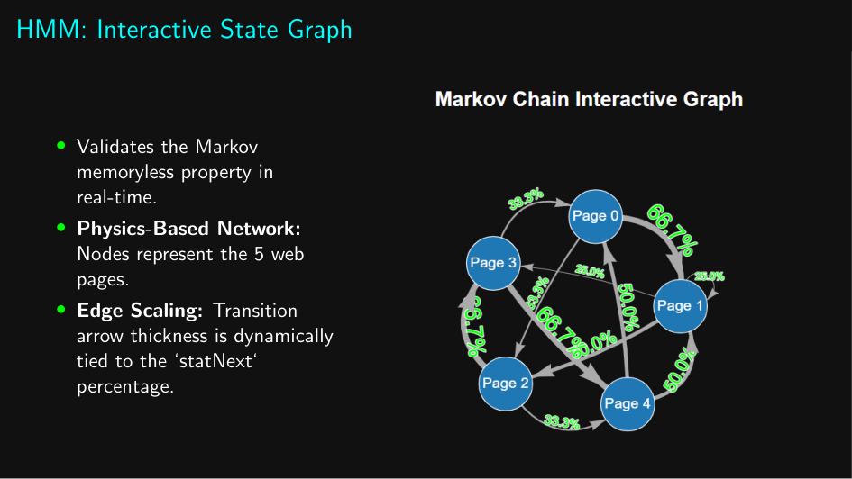
</div>

Physics-based directed graph (Vis.js) where:
- **Nodes** = 5 web pages arranged in a pentagon
- **Edge thickness** = `statNext` probability (thicker = more likely transition)
- **Edge labels** = Next% and Prev% probabilities

Validates the **Markov memoryless property** visually in real time.

### Transition Matrix Table

<div align="center">
  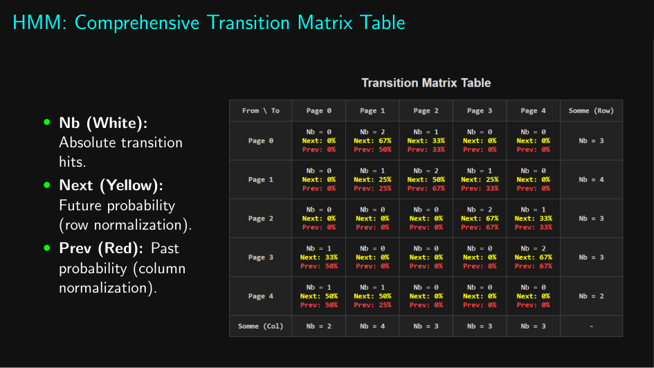
</div>

Each cell shows three values: `Nb` (absolute count), `Next%` (yellow, forward probability), `Prev%` (red, backward probability).

---

## Web Dashboard (Single Page Application)

<div align="center">

```
Open index.html in any modern browser — no server required
```

</div>

A dark-themed SPA with cyan accent (`#00FFFF`) unifying all three modules in one interface.

| Tab | Content |
|-----|---------|
| **Home / Overview** | Project info, tech description |
| **N-Lateration (3D)** | Run brute-force with configurable N & step → live Plotly 3D plot |
| **Fingerprinting (2D)** | Run K-NN + IDW with configurable K → Plotly 2D scatter plot |
| **Markov Models** | Interactive REPL → navigate pages → generates Vis.js graph + transition table |

**Tech stack:** HTML5, CSS3, Vanilla JS, `Plotly.js 2.27`, `Vis.js`

---

## Conclusion

<div align="center">
  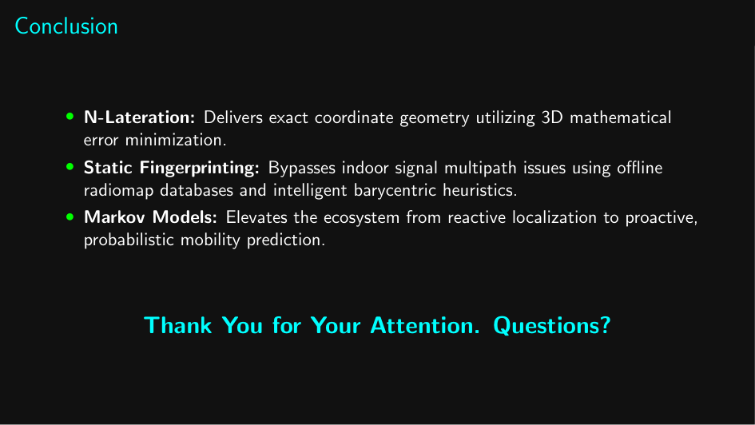
</div>

---

## Project Structure

```
IoT-Positioning-Ecosystem/
├── index.html                          SPA dashboard (all 3 modules)
├── Hmm/
│   ├── index.html                      Standalone HMM page
│   ├── InitMarkov.java                 HMM Java implementation
│   └── Cellule.java
├── fingerprint/
│   ├── Fingerprint.java                K-NN + IDW implementation
│   ├── FingerprintBonus.java
│   ├── Cell.java / I_Cell.java
│   ├── OfflineRSSI.java / I_OfflineRSSI.java
│   ├── Position.java / I_Position.java
│   └── RSSIV.java / I_RSSIV.java
├── n lateration/td2/
│   ├── NLateration.java                Brute-force 3D spatial search
│   ├── NLaterationBonus.java
│   ├── NEmitters.java / INEmitters.java
│   ├── Cell.java / ICell.java
│   └── Position.java / IPosition.java
├── doc/                                PDF worksheets & diagrams
├── images/                             Presentation slides (PDF-extracted)
└── positining_system_presentation.pdf  Full project presentation
```

---

## Tech Stack

| Category | Technology |
|----------|-----------|
| **Core Language** | Java 17 |
| **Web Frontend** | HTML5, CSS3, Vanilla JavaScript (ES6) |
| **3D/2D Plotting** | Plotly.js 2.27 |
| **Graph Visualization** | Vis.js (Network) |
| **Localization** | N-Lateration (L1 brute-force), Static Fingerprinting (K-NN + IDW) |
| **Prediction** | Hidden Markov Models (dual-probability 6×6 matrix) |

---

## Author

<div align="center">

| | Name | Program | Links |
|--|------|---------|-------|
| 👤 | **Ahmed Almuharaq** | M1 IoT | [GitHub](https://github.com/AhmedAlmuharaq) · [LinkedIn](https://www.linkedin.com/in/almuharaqa/) |

**Institution:** Université Marie et Louis Pasteur, UFR STGI, Montbéliard, France
**Year:** 2025–2026

</div>

---

<div align="center">

*Developed for academic purposes as part of the M1 PSTA (Positioning Systems, Techniques and Applications) curriculum.*

</div>
